# Fleet Management - Entity Relationship Diagram

## ERD Diagram

```mermaid
erDiagram
    VEHICLE ||--o{ TRIP : "assigned_to"
    VEHICLE ||--o{ MAINTENANCE : "requires"
    VEHICLE ||--o{ FUEL_RECORD : "consumes"
    VEHICLE ||--o{ INSURANCE : "covered_by"
    VEHICLE ||--o{ REGISTRATION : "registered_as"
    VEHICLE }o--|| VEHICLE_TYPE : "is_of_type"
    VEHICLE }o--|| LOCATION : "parked_at"
    
    DRIVER ||--o{ TRIP : "drives"
    DRIVER ||--o{ LICENSE : "holds"
    DRIVER }o--|| DEPARTMENT : "belongs_to"
    
    TRIP ||--o{ TRIP_ROUTE : "follows"
    TRIP }o--|| CUSTOMER : "serves"
    TRIP }o--|| ROUTE : "uses"
    
    ROUTE ||--o{ ROUTE_POINT : "contains"
    
    MAINTENANCE ||--o{ MAINTENANCE_ITEM : "includes"
    MAINTENANCE }o--|| VENDOR : "performed_by"
    MAINTENANCE }o--|| MAINTENANCE_TYPE : "is_of_type"
    
    FUEL_RECORD }o--|| FUEL_STATION : "purchased_at"
    FUEL_RECORD }o--|| FUEL_TYPE : "uses"
    
    INSURANCE }o--|| INSURANCE_COMPANY : "provided_by"
    
    VEHICLE {
        int vehicle_id PK
        string vin_number UK
        string license_plate UK
        string make
        string model
        int year
        string color
        decimal purchase_price
        date purchase_date
        decimal current_mileage
        string status
        int vehicle_type_id FK
        int location_id FK
        date created_date
        date updated_date
    }
    
    VEHICLE_TYPE {
        int vehicle_type_id PK
        string type_name
        string description
        decimal avg_fuel_consumption
    }
    
    DRIVER {
        int driver_id PK
        string employee_id UK
        string first_name
        string last_name
        string phone_number
        string email
        date date_of_birth
        date hire_date
        string status
        int department_id FK
        date created_date
    }
    
    LICENSE {
        int license_id PK
        int driver_id FK
        string license_number UK
        string license_type
        date issue_date
        date expiry_date
        string issuing_authority
        string status
    }
    
    DEPARTMENT {
        int department_id PK
        string department_name
        string description
        int manager_id
    }
    
    TRIP {
        int trip_id PK
        int vehicle_id FK
        int driver_id FK
        int route_id FK
        int customer_id FK
        date trip_date
        time start_time
        time end_time
        decimal start_mileage
        decimal end_mileage
        decimal distance_km
        decimal fuel_consumed
        string trip_status
        string purpose
        text notes
    }
    
    ROUTE {
        int route_id PK
        string route_name
        string origin
        string destination
        decimal total_distance_km
        decimal estimated_duration_minutes
        string route_type
    }
    
    ROUTE_POINT {
        int route_point_id PK
        int route_id FK
        int sequence_order
        decimal latitude
        decimal longitude
        string location_name
        string point_type
    }
    
    TRIP_ROUTE {
        int trip_route_id PK
        int trip_id FK
        int route_id FK
        int sequence_order
        decimal actual_distance
        time actual_time
    }
    
    CUSTOMER {
        int customer_id PK
        string customer_name
        string contact_person
        string phone_number
        string email
        string address
        string city
        string state
        string zip_code
        string customer_type
    }
    
    MAINTENANCE {
        int maintenance_id PK
        int vehicle_id FK
        int vendor_id FK
        int maintenance_type_id FK
        date maintenance_date
        decimal mileage_at_maintenance
        decimal cost
        string description
        string status
        date next_maintenance_due
        decimal next_maintenance_mileage
        text notes
    }
    
    MAINTENANCE_TYPE {
        int maintenance_type_id PK
        string type_name
        string description
        int recommended_interval_days
        decimal recommended_interval_miles
    }
    
    MAINTENANCE_ITEM {
        int maintenance_item_id PK
        int maintenance_id FK
        string item_name
        string item_type
        decimal quantity
        decimal unit_cost
        decimal total_cost
        text description
    }
    
    VENDOR {
        int vendor_id PK
        string vendor_name
        string contact_person
        string phone_number
        string email
        string address
        string city
        string state
        string zip_code
        string vendor_type
        string status
    }
    
    FUEL_RECORD {
        int fuel_record_id PK
        int vehicle_id FK
        int fuel_station_id FK
        int fuel_type_id FK
        date fuel_date
        time fuel_time
        decimal quantity_liters
        decimal cost_per_liter
        decimal total_cost
        decimal mileage_at_fuel
        decimal odometer_reading
        string payment_method
        text notes
    }
    
    FUEL_STATION {
        int fuel_station_id PK
        string station_name
        string address
        string city
        string state
        string zip_code
        string phone_number
        decimal latitude
        decimal longitude
    }
    
    FUEL_TYPE {
        int fuel_type_id PK
        string fuel_name
        string description
        string unit
    }
    
    INSURANCE {
        int insurance_id PK
        int vehicle_id FK
        int insurance_company_id FK
        string policy_number UK
        string coverage_type
        date start_date
        date expiry_date
        decimal premium_amount
        decimal coverage_amount
        string status
        text notes
    }
    
    INSURANCE_COMPANY {
        int insurance_company_id PK
        string company_name
        string contact_person
        string phone_number
        string email
        string address
    }
    
    REGISTRATION {
        int registration_id PK
        int vehicle_id FK
        string registration_number UK
        date registration_date
        date expiry_date
        string issuing_authority
        string status
        decimal registration_fee
    }
    
    LOCATION {
        int location_id PK
        string location_name
        string address
        string city
        string state
        string zip_code
        decimal latitude
        decimal longitude
        string location_type
        int capacity
    }
```

## Entity Descriptions

### Core Entities

1. **VEHICLE** - Represents all vehicles in the fleet
   - Key attributes: VIN, license plate, make, model, mileage, status
   - Relationships: Has trips, requires maintenance, consumes fuel, has insurance/registration

2. **DRIVER** - Represents drivers/employees who operate vehicles
   - Key attributes: Employee ID, name, contact info, hire date
   - Relationships: Drives trips, holds licenses, belongs to department

3. **TRIP** - Represents individual trips/journeys made by vehicles
   - Key attributes: Date, time, mileage, distance, fuel consumed
   - Relationships: Uses vehicle, driven by driver, follows route, serves customer

### Supporting Entities

4. **MAINTENANCE** - Records maintenance and repair activities
   - Tracks maintenance history, costs, and schedules

5. **FUEL_RECORD** - Records fuel purchases and consumption
   - Tracks fuel efficiency and costs

6. **INSURANCE** - Manages vehicle insurance policies
   - Tracks coverage, premiums, and expiry dates

7. **REGISTRATION** - Manages vehicle registration documents
   - Tracks registration status and expiry

8. **ROUTE** - Defines standard routes used by the fleet
   - Can be reused across multiple trips

9. **CUSTOMER** - Represents customers served by the fleet (if applicable)
   - For service/delivery fleets

10. **VENDOR** - Service providers for maintenance and repairs
    - Tracks vendor information and relationships

11. **LOCATION** - Physical locations (parking, depots, warehouses)
    - Tracks where vehicles are parked/stored

## Relationship Cardinalities

- **One-to-Many (1:N)**:
  - Vehicle → Trips (one vehicle makes many trips)
  - Driver → Trips (one driver makes many trips)
  - Vehicle → Maintenance (one vehicle has many maintenance records)
  - Route → Route Points (one route has many points)

- **Many-to-Many (M:N)**:
  - Trip ↔ Route (implemented via TRIP_ROUTE junction table)
  - Maintenance ↔ Items (implemented via MAINTENANCE_ITEM junction table)

- **One-to-One (1:1)**:
  - Vehicle → Current Location (simplified - could be many-to-one if tracking history)

## Key Features

1. **Complete Vehicle Lifecycle**: Tracks vehicles from purchase to disposal
2. **Driver Management**: Manages driver information, licenses, and assignments
3. **Trip Tracking**: Records all trips with mileage, fuel, and route information
4. **Maintenance Management**: Schedules and tracks maintenance activities
5. **Fuel Management**: Monitors fuel consumption and costs
6. **Compliance**: Tracks insurance and registration expiry dates
7. **Route Optimization**: Stores route information for analysis and reuse

## Notes

- All entities include audit fields (created_date, updated_date) where applicable
- Status fields allow for soft deletes and state management
- UK = Unique Key constraint
- PK = Primary Key
- FK = Foreign Key
