# Fleet Management System

## Data Modeling Report

**Document Version:** 1.0

**Date:** December 4, 2025

---

## Revision History

| **Version** | **Author** | **Date** | **Description** |
|-------------|------------|----------|-----------------|
| 1.0 | Data Team | 2025-12-04 | Initial ER Diagram and Data Model |

---

# Schema Overview

## Entity Relationship Diagram

```mermaid
erDiagram
    %% ===== CORE ENTITIES =====
    
    VEHICLE {
        int vehicle_id PK
        varchar vin UK
        varchar license_plate UK
        varchar make
        varchar model
        int year
        varchar color
        int vehicle_type_id FK
        int depot_id FK
        varchar status
        date purchase_date
        decimal purchase_price
        decimal current_odometer
        date last_service_date
        date next_service_due
        datetime created_at
        datetime updated_at
    }
    
    VEHICLE_TYPE {
        int vehicle_type_id PK
        varchar type_name
        varchar category
        int seating_capacity
        decimal cargo_capacity_kg
        decimal fuel_tank_capacity
        varchar fuel_type
        text description
    }
    
    DRIVER {
        int driver_id PK
        varchar employee_id UK
        varchar first_name
        varchar last_name
        varchar email UK
        varchar phone
        varchar license_number UK
        varchar license_class
        date license_expiry
        date date_of_birth
        date hire_date
        varchar status
        int depot_id FK
        varchar emergency_contact_name
        varchar emergency_contact_phone
        datetime created_at
        datetime updated_at
    }
    
    DEPOT {
        int depot_id PK
        varchar depot_name
        varchar address_line1
        varchar address_line2
        varchar city
        varchar state
        varchar postal_code
        varchar country
        decimal latitude
        decimal longitude
        varchar phone
        varchar manager_name
        int capacity
        varchar status
        datetime created_at
    }
    
    %% ===== TRIP MANAGEMENT =====
    
    TRIP {
        int trip_id PK
        int vehicle_id FK
        int driver_id FK
        int route_id FK
        datetime scheduled_start
        datetime scheduled_end
        datetime actual_start
        datetime actual_end
        decimal start_odometer
        decimal end_odometer
        varchar start_location
        varchar end_location
        varchar trip_type
        varchar status
        text notes
        datetime created_at
        datetime updated_at
    }
    
    ROUTE {
        int route_id PK
        varchar route_name
        varchar start_point
        varchar end_point
        decimal distance_km
        int estimated_duration_min
        text waypoints_json
        varchar status
        datetime created_at
    }
    
    TRIP_CHECKPOINT {
        int checkpoint_id PK
        int trip_id FK
        varchar location_name
        decimal latitude
        decimal longitude
        datetime planned_arrival
        datetime actual_arrival
        int sequence_order
        varchar status
        text notes
    }
    
    %% ===== MAINTENANCE =====
    
    MAINTENANCE_RECORD {
        int maintenance_id PK
        int vehicle_id FK
        int service_provider_id FK
        varchar maintenance_type
        date service_date
        decimal odometer_reading
        text description
        decimal labor_cost
        decimal parts_cost
        decimal total_cost
        date next_service_due
        varchar status
        text notes
        datetime created_at
    }
    
    MAINTENANCE_ITEM {
        int item_id PK
        int maintenance_id FK
        varchar item_name
        varchar part_number
        int quantity
        decimal unit_cost
        decimal total_cost
        varchar category
    }
    
    SERVICE_PROVIDER {
        int service_provider_id PK
        varchar provider_name
        varchar contact_name
        varchar phone
        varchar email
        varchar address
        varchar city
        varchar specialization
        varchar rating
        varchar status
        datetime created_at
    }
    
    %% ===== FUEL MANAGEMENT =====
    
    FUEL_LOG {
        int fuel_log_id PK
        int vehicle_id FK
        int driver_id FK
        datetime fill_date
        decimal odometer_reading
        decimal quantity_liters
        decimal price_per_liter
        decimal total_cost
        varchar fuel_type
        varchar station_name
        varchar station_location
        varchar payment_method
        varchar receipt_number
        datetime created_at
    }
    
    FUEL_CARD {
        int fuel_card_id PK
        varchar card_number UK
        int vehicle_id FK
        int driver_id FK
        date issue_date
        date expiry_date
        decimal monthly_limit
        varchar status
        datetime created_at
    }
    
    %% ===== INSURANCE & DOCUMENTS =====
    
    INSURANCE {
        int insurance_id PK
        int vehicle_id FK
        varchar policy_number UK
        varchar insurance_company
        varchar coverage_type
        date start_date
        date end_date
        decimal premium_amount
        decimal deductible
        decimal coverage_limit
        varchar status
        text notes
        datetime created_at
    }
    
    DOCUMENT {
        int document_id PK
        varchar document_type
        int vehicle_id FK
        int driver_id FK
        varchar document_number
        date issue_date
        date expiry_date
        varchar issuing_authority
        varchar file_path
        varchar status
        datetime created_at
    }
    
    %% ===== INCIDENT MANAGEMENT =====
    
    INCIDENT {
        int incident_id PK
        int vehicle_id FK
        int driver_id FK
        int trip_id FK
        datetime incident_datetime
        varchar incident_type
        varchar location
        decimal latitude
        decimal longitude
        text description
        varchar severity
        decimal damage_estimate
        varchar police_report_number
        varchar insurance_claim_number
        varchar status
        datetime created_at
        datetime updated_at
    }
    
    INCIDENT_PARTY {
        int party_id PK
        int incident_id FK
        varchar party_type
        varchar name
        varchar contact_phone
        varchar vehicle_info
        varchar insurance_info
        text notes
    }
    
    %% ===== DRIVER ASSIGNMENT =====
    
    DRIVER_VEHICLE_ASSIGNMENT {
        int assignment_id PK
        int driver_id FK
        int vehicle_id FK
        date start_date
        date end_date
        varchar assignment_type
        varchar status
        text notes
        datetime created_at
    }
    
    %% ===== INSPECTION =====
    
    VEHICLE_INSPECTION {
        int inspection_id PK
        int vehicle_id FK
        int driver_id FK
        datetime inspection_date
        varchar inspection_type
        decimal odometer_reading
        varchar overall_condition
        boolean exterior_ok
        boolean interior_ok
        boolean tires_ok
        boolean brakes_ok
        boolean lights_ok
        boolean fluids_ok
        boolean documents_ok
        text defects_found
        text notes
        varchar status
        datetime created_at
    }
    
    %% ===== GPS TRACKING =====
    
    GPS_TRACKING {
        bigint tracking_id PK
        int vehicle_id FK
        datetime timestamp
        decimal latitude
        decimal longitude
        decimal speed_kmh
        decimal heading
        varchar ignition_status
        decimal fuel_level_percent
        varchar event_type
    }
    
    %% ===== CUSTOMER (for delivery fleets) =====
    
    CUSTOMER {
        int customer_id PK
        varchar customer_name
        varchar contact_name
        varchar email
        varchar phone
        varchar address
        varchar city
        varchar state
        varchar postal_code
        varchar customer_type
        varchar status
        datetime created_at
    }
    
    DELIVERY {
        int delivery_id PK
        int trip_id FK
        int customer_id FK
        varchar delivery_address
        datetime scheduled_time
        datetime actual_time
        varchar status
        varchar signature_file
        text notes
        datetime created_at
    }
    
    %% ===== RELATIONSHIPS =====
    
    VEHICLE_TYPE ||--o{ VEHICLE : "categorizes"
    DEPOT ||--o{ VEHICLE : "houses"
    DEPOT ||--o{ DRIVER : "assigns"
    
    VEHICLE ||--o{ TRIP : "used_in"
    DRIVER ||--o{ TRIP : "drives"
    ROUTE ||--o{ TRIP : "follows"
    TRIP ||--o{ TRIP_CHECKPOINT : "has"
    
    VEHICLE ||--o{ MAINTENANCE_RECORD : "receives"
    SERVICE_PROVIDER ||--o{ MAINTENANCE_RECORD : "performs"
    MAINTENANCE_RECORD ||--o{ MAINTENANCE_ITEM : "includes"
    
    VEHICLE ||--o{ FUEL_LOG : "consumes"
    DRIVER ||--o{ FUEL_LOG : "fills"
    VEHICLE ||--o| FUEL_CARD : "assigned"
    DRIVER ||--o| FUEL_CARD : "holds"
    
    VEHICLE ||--o{ INSURANCE : "covered_by"
    VEHICLE ||--o{ DOCUMENT : "has"
    DRIVER ||--o{ DOCUMENT : "has"
    
    VEHICLE ||--o{ INCIDENT : "involved_in"
    DRIVER ||--o{ INCIDENT : "involved_in"
    TRIP ||--o{ INCIDENT : "occurs_during"
    INCIDENT ||--o{ INCIDENT_PARTY : "involves"
    
    DRIVER ||--o{ DRIVER_VEHICLE_ASSIGNMENT : "assigned"
    VEHICLE ||--o{ DRIVER_VEHICLE_ASSIGNMENT : "assigned_to"
    
    VEHICLE ||--o{ VEHICLE_INSPECTION : "inspected"
    DRIVER ||--o{ VEHICLE_INSPECTION : "inspects"
    
    VEHICLE ||--o{ GPS_TRACKING : "tracked"
    
    TRIP ||--o{ DELIVERY : "includes"
    CUSTOMER ||--o{ DELIVERY : "receives"
```

---

# Data Definitions

## Core Entities

### VEHICLE
| **Column** | **Business Description** | **Data Type** | **Nullable** |
|------------|--------------------------|---------------|--------------|
| vehicle_id | Primary key - unique vehicle identifier | INT | N |
| vin | Vehicle Identification Number (17 characters) | VARCHAR(17) | N |
| license_plate | Vehicle registration plate number | VARCHAR(20) | N |
| make | Vehicle manufacturer (e.g., Ford, Toyota) | VARCHAR(50) | N |
| model | Vehicle model name | VARCHAR(50) | N |
| year | Manufacturing year | INT | N |
| color | Vehicle color | VARCHAR(30) | Y |
| vehicle_type_id | FK to VEHICLE_TYPE table | INT | N |
| depot_id | FK to DEPOT - home location | INT | N |
| status | Current status: Active, Inactive, Maintenance, Retired | VARCHAR(20) | N |
| purchase_date | Date vehicle was acquired | DATE | Y |
| purchase_price | Original purchase price | DECIMAL(12,2) | Y |
| current_odometer | Current odometer reading in km | DECIMAL(12,2) | N |
| last_service_date | Date of most recent service | DATE | Y |
| next_service_due | Date when next service is due | DATE | Y |
| created_at | Record creation timestamp | DATETIME | N |
| updated_at | Record last update timestamp | DATETIME | N |

### VEHICLE_TYPE
| **Column** | **Business Description** | **Data Type** | **Nullable** |
|------------|--------------------------|---------------|--------------|
| vehicle_type_id | Primary key | INT | N |
| type_name | Type name (e.g., Sedan, SUV, Truck, Van) | VARCHAR(50) | N |
| category | Category: Passenger, Cargo, Heavy, Specialty | VARCHAR(30) | N |
| seating_capacity | Number of passenger seats | INT | Y |
| cargo_capacity_kg | Maximum cargo weight in kilograms | DECIMAL(10,2) | Y |
| fuel_tank_capacity | Fuel tank capacity in liters | DECIMAL(8,2) | Y |
| fuel_type | Fuel type: Petrol, Diesel, Electric, Hybrid | VARCHAR(20) | N |
| description | Additional description | TEXT | Y |

### DRIVER
| **Column** | **Business Description** | **Data Type** | **Nullable** |
|------------|--------------------------|---------------|--------------|
| driver_id | Primary key - unique driver identifier | INT | N |
| employee_id | Company employee ID | VARCHAR(20) | N |
| first_name | Driver's first name | VARCHAR(50) | N |
| last_name | Driver's last name | VARCHAR(50) | N |
| email | Driver's email address | VARCHAR(100) | N |
| phone | Driver's phone number | VARCHAR(20) | N |
| license_number | Driving license number | VARCHAR(30) | N |
| license_class | License class/type (A, B, C, D, etc.) | VARCHAR(10) | N |
| license_expiry | License expiration date | DATE | N |
| date_of_birth | Driver's date of birth | DATE | N |
| hire_date | Employment start date | DATE | N |
| status | Current status: Active, Inactive, On Leave, Terminated | VARCHAR(20) | N |
| depot_id | FK to DEPOT - assigned depot | INT | N |
| emergency_contact_name | Emergency contact person name | VARCHAR(100) | Y |
| emergency_contact_phone | Emergency contact phone number | VARCHAR(20) | Y |
| created_at | Record creation timestamp | DATETIME | N |
| updated_at | Record last update timestamp | DATETIME | N |

### DEPOT
| **Column** | **Business Description** | **Data Type** | **Nullable** |
|------------|--------------------------|---------------|--------------|
| depot_id | Primary key - unique depot identifier | INT | N |
| depot_name | Name of the depot/location | VARCHAR(100) | N |
| address_line1 | Street address line 1 | VARCHAR(200) | N |
| address_line2 | Street address line 2 | VARCHAR(200) | Y |
| city | City name | VARCHAR(100) | N |
| state | State/Province | VARCHAR(100) | N |
| postal_code | Postal/ZIP code | VARCHAR(20) | N |
| country | Country | VARCHAR(100) | N |
| latitude | GPS latitude coordinate | DECIMAL(10,8) | Y |
| longitude | GPS longitude coordinate | DECIMAL(11,8) | Y |
| phone | Depot phone number | VARCHAR(20) | Y |
| manager_name | Depot manager name | VARCHAR(100) | Y |
| capacity | Maximum number of vehicles | INT | Y |
| status | Status: Active, Inactive | VARCHAR(20) | N |
| created_at | Record creation timestamp | DATETIME | N |

---

## Trip Management

### TRIP
| **Column** | **Business Description** | **Data Type** | **Nullable** |
|------------|--------------------------|---------------|--------------|
| trip_id | Primary key - unique trip identifier | INT | N |
| vehicle_id | FK to VEHICLE table | INT | N |
| driver_id | FK to DRIVER table | INT | N |
| route_id | FK to ROUTE table (optional) | INT | Y |
| scheduled_start | Planned departure time | DATETIME | N |
| scheduled_end | Planned arrival time | DATETIME | Y |
| actual_start | Actual departure time | DATETIME | Y |
| actual_end | Actual arrival time | DATETIME | Y |
| start_odometer | Odometer at trip start | DECIMAL(12,2) | Y |
| end_odometer | Odometer at trip end | DECIMAL(12,2) | Y |
| start_location | Starting location description | VARCHAR(200) | N |
| end_location | Destination location description | VARCHAR(200) | N |
| trip_type | Type: Delivery, Pickup, Service, Personal | VARCHAR(30) | N |
| status | Status: Scheduled, In Progress, Completed, Cancelled | VARCHAR(20) | N |
| notes | Additional notes | TEXT | Y |
| created_at | Record creation timestamp | DATETIME | N |
| updated_at | Record last update timestamp | DATETIME | N |

### ROUTE
| **Column** | **Business Description** | **Data Type** | **Nullable** |
|------------|--------------------------|---------------|--------------|
| route_id | Primary key - unique route identifier | INT | N |
| route_name | Descriptive route name | VARCHAR(100) | N |
| start_point | Starting point description | VARCHAR(200) | N |
| end_point | End point description | VARCHAR(200) | N |
| distance_km | Total route distance in kilometers | DECIMAL(10,2) | Y |
| estimated_duration_min | Estimated travel time in minutes | INT | Y |
| waypoints_json | JSON array of waypoints with coordinates | TEXT | Y |
| status | Status: Active, Inactive | VARCHAR(20) | N |
| created_at | Record creation timestamp | DATETIME | N |

### TRIP_CHECKPOINT
| **Column** | **Business Description** | **Data Type** | **Nullable** |
|------------|--------------------------|---------------|--------------|
| checkpoint_id | Primary key | INT | N |
| trip_id | FK to TRIP table | INT | N |
| location_name | Name/description of checkpoint location | VARCHAR(200) | N |
| latitude | GPS latitude coordinate | DECIMAL(10,8) | Y |
| longitude | GPS longitude coordinate | DECIMAL(11,8) | Y |
| planned_arrival | Planned arrival time at checkpoint | DATETIME | Y |
| actual_arrival | Actual arrival time at checkpoint | DATETIME | Y |
| sequence_order | Order of checkpoint in the trip | INT | N |
| status | Status: Pending, Reached, Skipped | VARCHAR(20) | N |
| notes | Additional notes | TEXT | Y |

---

## Maintenance Management

### MAINTENANCE_RECORD
| **Column** | **Business Description** | **Data Type** | **Nullable** |
|------------|--------------------------|---------------|--------------|
| maintenance_id | Primary key | INT | N |
| vehicle_id | FK to VEHICLE table | INT | N |
| service_provider_id | FK to SERVICE_PROVIDER table | INT | Y |
| maintenance_type | Type: Scheduled, Unscheduled, Repair, Inspection | VARCHAR(30) | N |
| service_date | Date service was performed | DATE | N |
| odometer_reading | Odometer at time of service | DECIMAL(12,2) | N |
| description | Description of work performed | TEXT | N |
| labor_cost | Labor charges | DECIMAL(10,2) | Y |
| parts_cost | Parts/materials cost | DECIMAL(10,2) | Y |
| total_cost | Total maintenance cost | DECIMAL(10,2) | N |
| next_service_due | Recommended next service date | DATE | Y |
| status | Status: Scheduled, In Progress, Completed, Cancelled | VARCHAR(20) | N |
| notes | Additional notes | TEXT | Y |
| created_at | Record creation timestamp | DATETIME | N |

### MAINTENANCE_ITEM
| **Column** | **Business Description** | **Data Type** | **Nullable** |
|------------|--------------------------|---------------|--------------|
| item_id | Primary key | INT | N |
| maintenance_id | FK to MAINTENANCE_RECORD table | INT | N |
| item_name | Name of part or service item | VARCHAR(100) | N |
| part_number | Part number/SKU if applicable | VARCHAR(50) | Y |
| quantity | Quantity used | INT | N |
| unit_cost | Cost per unit | DECIMAL(10,2) | N |
| total_cost | Total cost for this item | DECIMAL(10,2) | N |
| category | Category: Parts, Labor, Consumable, Other | VARCHAR(30) | N |

### SERVICE_PROVIDER
| **Column** | **Business Description** | **Data Type** | **Nullable** |
|------------|--------------------------|---------------|--------------|
| service_provider_id | Primary key | INT | N |
| provider_name | Business name | VARCHAR(100) | N |
| contact_name | Primary contact person | VARCHAR(100) | Y |
| phone | Phone number | VARCHAR(20) | Y |
| email | Email address | VARCHAR(100) | Y |
| address | Street address | VARCHAR(200) | Y |
| city | City | VARCHAR(100) | Y |
| specialization | Specialization: General, Tires, Engine, Body, Electric | VARCHAR(50) | Y |
| rating | Service rating: A, B, C, D | VARCHAR(5) | Y |
| status | Status: Active, Inactive | VARCHAR(20) | N |
| created_at | Record creation timestamp | DATETIME | N |

---

## Fuel Management

### FUEL_LOG
| **Column** | **Business Description** | **Data Type** | **Nullable** |
|------------|--------------------------|---------------|--------------|
| fuel_log_id | Primary key | INT | N |
| vehicle_id | FK to VEHICLE table | INT | N |
| driver_id | FK to DRIVER table | INT | N |
| fill_date | Date and time of fuel fill | DATETIME | N |
| odometer_reading | Odometer reading at fill | DECIMAL(12,2) | N |
| quantity_liters | Amount of fuel in liters | DECIMAL(8,2) | N |
| price_per_liter | Price per liter | DECIMAL(6,3) | N |
| total_cost | Total fuel cost | DECIMAL(10,2) | N |
| fuel_type | Type: Petrol, Diesel, Premium, Electric | VARCHAR(20) | N |
| station_name | Fuel station name | VARCHAR(100) | Y |
| station_location | Station location/address | VARCHAR(200) | Y |
| payment_method | Payment: Cash, Card, Fuel Card, Account | VARCHAR(30) | N |
| receipt_number | Receipt/transaction number | VARCHAR(50) | Y |
| created_at | Record creation timestamp | DATETIME | N |

### FUEL_CARD
| **Column** | **Business Description** | **Data Type** | **Nullable** |
|------------|--------------------------|---------------|--------------|
| fuel_card_id | Primary key | INT | N |
| card_number | Fuel card number | VARCHAR(30) | N |
| vehicle_id | FK to VEHICLE - assigned vehicle | INT | Y |
| driver_id | FK to DRIVER - assigned driver | INT | Y |
| issue_date | Date card was issued | DATE | N |
| expiry_date | Card expiration date | DATE | N |
| monthly_limit | Monthly spending limit | DECIMAL(10,2) | Y |
| status | Status: Active, Suspended, Cancelled, Expired | VARCHAR(20) | N |
| created_at | Record creation timestamp | DATETIME | N |

---

## Insurance & Documents

### INSURANCE
| **Column** | **Business Description** | **Data Type** | **Nullable** |
|------------|--------------------------|---------------|--------------|
| insurance_id | Primary key | INT | N |
| vehicle_id | FK to VEHICLE table | INT | N |
| policy_number | Insurance policy number | VARCHAR(50) | N |
| insurance_company | Insurance company name | VARCHAR(100) | N |
| coverage_type | Type: Comprehensive, Third Party, Basic | VARCHAR(30) | N |
| start_date | Policy start date | DATE | N |
| end_date | Policy end date | DATE | N |
| premium_amount | Annual premium amount | DECIMAL(10,2) | N |
| deductible | Deductible amount | DECIMAL(10,2) | Y |
| coverage_limit | Maximum coverage amount | DECIMAL(12,2) | Y |
| status | Status: Active, Expired, Cancelled | VARCHAR(20) | N |
| notes | Additional notes | TEXT | Y |
| created_at | Record creation timestamp | DATETIME | N |

### DOCUMENT
| **Column** | **Business Description** | **Data Type** | **Nullable** |
|------------|--------------------------|---------------|--------------|
| document_id | Primary key | INT | N |
| document_type | Type: Registration, License, Permit, Certificate | VARCHAR(50) | N |
| vehicle_id | FK to VEHICLE (if vehicle document) | INT | Y |
| driver_id | FK to DRIVER (if driver document) | INT | Y |
| document_number | Document number/ID | VARCHAR(50) | N |
| issue_date | Date document was issued | DATE | N |
| expiry_date | Document expiration date | DATE | Y |
| issuing_authority | Authority that issued the document | VARCHAR(100) | Y |
| file_path | Path to scanned document file | VARCHAR(500) | Y |
| status | Status: Valid, Expired, Pending Renewal | VARCHAR(20) | N |
| created_at | Record creation timestamp | DATETIME | N |

---

## Incident Management

### INCIDENT
| **Column** | **Business Description** | **Data Type** | **Nullable** |
|------------|--------------------------|---------------|--------------|
| incident_id | Primary key | INT | N |
| vehicle_id | FK to VEHICLE table | INT | N |
| driver_id | FK to DRIVER table | INT | N |
| trip_id | FK to TRIP table (if during trip) | INT | Y |
| incident_datetime | Date and time of incident | DATETIME | N |
| incident_type | Type: Accident, Breakdown, Theft, Vandalism | VARCHAR(30) | N |
| location | Location description | VARCHAR(200) | N |
| latitude | GPS latitude of incident | DECIMAL(10,8) | Y |
| longitude | GPS longitude of incident | DECIMAL(11,8) | Y |
| description | Detailed incident description | TEXT | N |
| severity | Severity: Minor, Moderate, Major, Critical | VARCHAR(20) | N |
| damage_estimate | Estimated damage cost | DECIMAL(12,2) | Y |
| police_report_number | Police report reference | VARCHAR(50) | Y |
| insurance_claim_number | Insurance claim reference | VARCHAR(50) | Y |
| status | Status: Reported, Under Investigation, Resolved, Closed | VARCHAR(30) | N |
| created_at | Record creation timestamp | DATETIME | N |
| updated_at | Record last update timestamp | DATETIME | N |

### INCIDENT_PARTY
| **Column** | **Business Description** | **Data Type** | **Nullable** |
|------------|--------------------------|---------------|--------------|
| party_id | Primary key | INT | N |
| incident_id | FK to INCIDENT table | INT | N |
| party_type | Type: Driver, Pedestrian, Third Party Vehicle, Witness | VARCHAR(30) | N |
| name | Person's name | VARCHAR(100) | N |
| contact_phone | Contact phone number | VARCHAR(20) | Y |
| vehicle_info | Vehicle details if applicable | VARCHAR(200) | Y |
| insurance_info | Insurance details if applicable | VARCHAR(200) | Y |
| notes | Additional notes | TEXT | Y |

---

## Driver & Vehicle Assignment

### DRIVER_VEHICLE_ASSIGNMENT
| **Column** | **Business Description** | **Data Type** | **Nullable** |
|------------|--------------------------|---------------|--------------|
| assignment_id | Primary key | INT | N |
| driver_id | FK to DRIVER table | INT | N |
| vehicle_id | FK to VEHICLE table | INT | N |
| start_date | Assignment start date | DATE | N |
| end_date | Assignment end date (null if current) | DATE | Y |
| assignment_type | Type: Primary, Secondary, Temporary | VARCHAR(20) | N |
| status | Status: Active, Ended | VARCHAR(20) | N |
| notes | Additional notes | TEXT | Y |
| created_at | Record creation timestamp | DATETIME | N |

---

## Vehicle Inspection

### VEHICLE_INSPECTION
| **Column** | **Business Description** | **Data Type** | **Nullable** |
|------------|--------------------------|---------------|--------------|
| inspection_id | Primary key | INT | N |
| vehicle_id | FK to VEHICLE table | INT | N |
| driver_id | FK to DRIVER table (inspector) | INT | N |
| inspection_date | Date and time of inspection | DATETIME | N |
| inspection_type | Type: Pre-Trip, Post-Trip, Weekly, Monthly | VARCHAR(30) | N |
| odometer_reading | Odometer at inspection | DECIMAL(12,2) | N |
| overall_condition | Overall: Good, Fair, Poor, Needs Repair | VARCHAR(20) | N |
| exterior_ok | Exterior condition pass | BOOLEAN | N |
| interior_ok | Interior condition pass | BOOLEAN | N |
| tires_ok | Tires condition pass | BOOLEAN | N |
| brakes_ok | Brakes condition pass | BOOLEAN | N |
| lights_ok | Lights condition pass | BOOLEAN | N |
| fluids_ok | Fluids levels pass | BOOLEAN | N |
| documents_ok | Required documents present | BOOLEAN | N |
| defects_found | Description of any defects | TEXT | Y |
| notes | Additional notes | TEXT | Y |
| status | Status: Passed, Failed, Pending Review | VARCHAR(20) | N |
| created_at | Record creation timestamp | DATETIME | N |

---

## GPS Tracking

### GPS_TRACKING
| **Column** | **Business Description** | **Data Type** | **Nullable** |
|------------|--------------------------|---------------|--------------|
| tracking_id | Primary key | BIGINT | N |
| vehicle_id | FK to VEHICLE table | INT | N |
| timestamp | Date and time of GPS reading | DATETIME | N |
| latitude | GPS latitude coordinate | DECIMAL(10,8) | N |
| longitude | GPS longitude coordinate | DECIMAL(11,8) | N |
| speed_kmh | Vehicle speed in km/h | DECIMAL(6,2) | Y |
| heading | Direction of travel (0-360 degrees) | DECIMAL(5,2) | Y |
| ignition_status | Ignition: On, Off | VARCHAR(10) | Y |
| fuel_level_percent | Fuel level percentage | DECIMAL(5,2) | Y |
| event_type | Event: Location, Speeding, Harsh Brake, Idle | VARCHAR(30) | Y |

---

## Customer & Delivery (for Delivery/Logistics Fleets)

### CUSTOMER
| **Column** | **Business Description** | **Data Type** | **Nullable** |
|------------|--------------------------|---------------|--------------|
| customer_id | Primary key | INT | N |
| customer_name | Customer/company name | VARCHAR(100) | N |
| contact_name | Primary contact person | VARCHAR(100) | Y |
| email | Email address | VARCHAR(100) | Y |
| phone | Phone number | VARCHAR(20) | Y |
| address | Street address | VARCHAR(200) | Y |
| city | City | VARCHAR(100) | Y |
| state | State/Province | VARCHAR(100) | Y |
| postal_code | Postal/ZIP code | VARCHAR(20) | Y |
| customer_type | Type: Individual, Business, Government | VARCHAR(30) | N |
| status | Status: Active, Inactive | VARCHAR(20) | N |
| created_at | Record creation timestamp | DATETIME | N |

### DELIVERY
| **Column** | **Business Description** | **Data Type** | **Nullable** |
|------------|--------------------------|---------------|--------------|
| delivery_id | Primary key | INT | N |
| trip_id | FK to TRIP table | INT | N |
| customer_id | FK to CUSTOMER table | INT | N |
| delivery_address | Full delivery address | VARCHAR(300) | N |
| scheduled_time | Planned delivery time | DATETIME | N |
| actual_time | Actual delivery time | DATETIME | Y |
| status | Status: Pending, In Transit, Delivered, Failed | VARCHAR(20) | N |
| signature_file | Path to signature image | VARCHAR(500) | Y |
| notes | Delivery notes | TEXT | Y |
| created_at | Record creation timestamp | DATETIME | N |

---

# Relationship Summary

| **Parent Entity** | **Child Entity** | **Relationship Type** | **Description** |
|-------------------|------------------|----------------------|-----------------|
| VEHICLE_TYPE | VEHICLE | One-to-Many | A vehicle type categorizes many vehicles |
| DEPOT | VEHICLE | One-to-Many | A depot houses many vehicles |
| DEPOT | DRIVER | One-to-Many | A depot has many assigned drivers |
| VEHICLE | TRIP | One-to-Many | A vehicle is used in many trips |
| DRIVER | TRIP | One-to-Many | A driver drives many trips |
| ROUTE | TRIP | One-to-Many | A route is used by many trips |
| TRIP | TRIP_CHECKPOINT | One-to-Many | A trip has many checkpoints |
| VEHICLE | MAINTENANCE_RECORD | One-to-Many | A vehicle has many maintenance records |
| SERVICE_PROVIDER | MAINTENANCE_RECORD | One-to-Many | A provider performs many services |
| MAINTENANCE_RECORD | MAINTENANCE_ITEM | One-to-Many | A maintenance has many items |
| VEHICLE | FUEL_LOG | One-to-Many | A vehicle has many fuel logs |
| DRIVER | FUEL_LOG | One-to-Many | A driver creates many fuel logs |
| VEHICLE | INSURANCE | One-to-Many | A vehicle has many insurance policies |
| VEHICLE | DOCUMENT | One-to-Many | A vehicle has many documents |
| DRIVER | DOCUMENT | One-to-Many | A driver has many documents |
| VEHICLE | INCIDENT | One-to-Many | A vehicle is involved in many incidents |
| DRIVER | INCIDENT | One-to-Many | A driver is involved in many incidents |
| INCIDENT | INCIDENT_PARTY | One-to-Many | An incident involves many parties |
| DRIVER | DRIVER_VEHICLE_ASSIGNMENT | One-to-Many | A driver has many vehicle assignments |
| VEHICLE | DRIVER_VEHICLE_ASSIGNMENT | One-to-Many | A vehicle has many driver assignments |
| VEHICLE | VEHICLE_INSPECTION | One-to-Many | A vehicle has many inspections |
| VEHICLE | GPS_TRACKING | One-to-Many | A vehicle has many GPS records |
| TRIP | DELIVERY | One-to-Many | A trip includes many deliveries |
| CUSTOMER | DELIVERY | One-to-Many | A customer receives many deliveries |

---

# Assumptions

1. **Vehicle Identification**: Each vehicle has a unique VIN and license plate number
2. **Driver Licensing**: All drivers have valid driving licenses appropriate for their assigned vehicle types
3. **Depot Operations**: Vehicles and drivers are assigned to a primary depot but can operate from other locations
4. **GPS Tracking**: Vehicles are equipped with GPS tracking devices that report location data
5. **Fuel Cards**: Fuel cards may be assigned to either a vehicle or a driver, or both
6. **Maintenance Schedule**: Vehicles require regular scheduled maintenance based on time and/or mileage
7. **Document Management**: System stores references to scanned documents, not the actual files
8. **Multi-tenancy**: This schema supports a single fleet operator; for multi-tenant, add organization_id

---

# Indexes Recommendations

| **Table** | **Columns** | **Index Type** | **Rationale** |
|-----------|-------------|----------------|---------------|
| VEHICLE | vin | Unique | VIN lookup |
| VEHICLE | license_plate | Unique | License plate lookup |
| VEHICLE | status, depot_id | Composite | Active vehicles by depot |
| DRIVER | license_number | Unique | License verification |
| DRIVER | status, depot_id | Composite | Active drivers by depot |
| TRIP | vehicle_id, scheduled_start | Composite | Trip history by vehicle |
| TRIP | driver_id, scheduled_start | Composite | Trip history by driver |
| TRIP | status | Index | Filter by status |
| FUEL_LOG | vehicle_id, fill_date | Composite | Fuel history by vehicle |
| GPS_TRACKING | vehicle_id, timestamp | Composite | Location history |
| MAINTENANCE_RECORD | vehicle_id, service_date | Composite | Maintenance history |
| DOCUMENT | expiry_date | Index | Expiring documents alert |
| INSURANCE | end_date | Index | Expiring policies alert |

---

*This ER diagram provides a comprehensive foundation for a fleet management system, covering vehicle management, driver management, trip tracking, maintenance, fuel consumption, insurance, incidents, and GPS tracking.*
